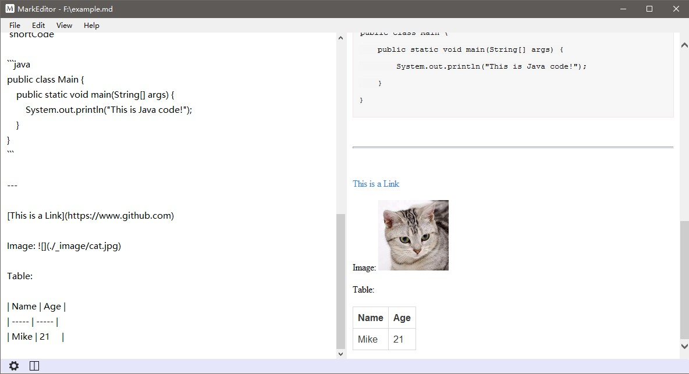

# MarkEditor
MarkEditor is a lightweight Markdown Editor powered by [Markdig](https://github.com/lunet-io/markdig), a fast Markdown processor.

## Why Another Markdown Editor?
Since there are so many Markdown editors now, why make another one? Well, the only reason is that I can't find one which both **supports all the features below** and is **lightweight**.
- Relative path for Images/Attachments
- Dragdroping Images/Attachments
- Pasting Images/Attachments from clipboard
- All Images/Attachments located in one place - *The folder where the current Markdown file is*
- Customizable CSS style

## It Looks Like This

## Author
IntFrog (https://github.com/intfrog)